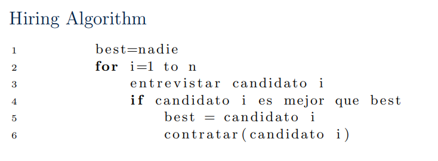

# Discusión: Análisis probabilístico y algoritmos

## Integrantes
- Christian Echeverría 221441
- Gustavo Cruz 22779
- Josué Say 22801
- Mathew Cordero 22982
- Pedro Guzmán 22111

## 1 . ¿Que podemos decir acerca del tiempo de ejecucion en diferentes ejecuciones de un algoritmo aleatorizado? ¿Que es lo que podemos medir al analizar un algoritmo aleatorizado?


Un algoritmo aleatorizado tiene un tiempo de ejecucion de estimacion. Esto se debe a la naturaleza volatil de los algoritmos que se analizan. Por lo  tanto es como si se calculase una probabilidad sobre el tiempo estiamado dado por $E[x]$  donde x sera n en O(n) 





## 2. ¿Cuales son el best-case y worst-case scenarios para este algoritmo?


Para hacer este analisis analizamos cada linea

### Worst Case

En este caso para analizarlo vamos a ir linea por linea

Hiring Algorithm

```

1    best = nadie   ---> O(1)
2    for i = 1 to n   -> sumatoria hasta n
3        entrevistar candidato i  ---> O(1)
4        if candidato i es mejor que best ---> O(1)
5            best = candidato i ---> O(1)
6            contratar(candidato i) ---> O(1)
```

Teniendo un arreglo de usuarios de tamaño n entonces vamos a definir que 


$$
T(n) = \sum_{i=0}^{n} 4O(1) + C
$$


$$
T(n) = \sum_{i=0}^{n} O(1)
$$

$$
T(n) = (n+1)⋅O(1)
$$

$$
T(n) = O(n)
$$

### Best Case

Para este sabemos que el mejor siempre va  a ser el primero ya que la lista viene ordenada de mayor a menor por ende el best case es:

$$
O(1)
$$


## 3. ¿De que depende el costo de este algoritmo de solucion para el hiring problem? ¿Cual parte de ese costo podemos calcular directamente y cual no? ¿Que nos impide calcular la parte que no podemos?


- El costo depende exclusivamente de quien es el mejor , y el mejor sera dado por el costo de entrevistar y el costo de contratar a nuestro usuario.

Entonces si lo definimos en variables serian Costo de contratación (Ch), Costo de entrevista (Ci) , Número de candidatos (n)


- El costo de entrevistas se calcula directamente, pSabemos el número de candidatos (n) y podemos estimar el costo de entrevistar a cada uno.

- Lo que no se puede calcular de manera directa es el costo de contratar. Esto porque dependera de cuando encontremos un nuevo mejor candidato, es como cuando se recalcula el valor de los mejores que hemos encontrado por cada nueva corrida. Esto solamente es un valor estimado.

