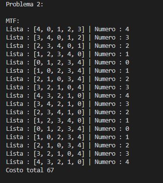
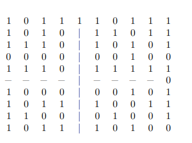

# Parcial 2 Analisis de Algoritmos

[Link al Repositorio](https://github.com/donmatthiuz/Analisis_Diseno/tree/parcial2)

## Integrantes

- Mathew Cordero Aquino [22982]


## Instrucciones

- Debe realizar este examen de forma individual.

- Debe entregar la respuesta a las preguntas planteadas acompa ̃nada de un an ́alisis riguroso y
explicaci ́on pertinente, i.e., no se aceptar ́an respuestas sin procedimiento ni explicaci ́on y la
nota ser ́a autom ́aticamente de cero puntos.

- Entregue un PDF con la resoluci ́on para su parcial y adem ́as grabe un video de no m ́as de
5 minutos de longitud en donde muestre la ejecuci ́on de los programas planteados en cada
problema que usted realice. S ́ubalo a YouTube como no listado e incl ́uyalo en su PDF de
respuestas.

- Duraci ́on: este examen se encontrar ́a habilitado para su realizaci ́on desde el [Fecha Inicial]
hasta el [Fecha Final], por lo que podr ́a realizarlo a su conveniencia en los tiempos que mejor
se ajusten a su intinerario. Solo podr ́a subir sus respuestas una vez, as ́ı que est ́e seguro de las
mismas.

- Este parcial contiene m ́ultiples problemas, con diferente valoraci ́on de puntos. Elija aquella
combinaci ́on de problemas que lo lleve a un punteo completo. Si elije problemas extra, se
tomar ́an como puntos extra que puede utilizar en otras entregas. Se har ́a una regla de tres
con base en la puntuaci ́on total del parcial en puntos netos para definir cu ́antos puntos netos
extra tendr ́a.

- Buena suerte y recuerde que Diosito lo/la est ́a viendo


## Problemas


### 2.1 Problema 1 [40 puntos]

Dado un numero positivo n y un teclado movil de un Nokia 3230, que tiene digitos del 0 al 9
asociados con cada tecla, se desea contar el total de combinaciones posibles de diıgitos de longitud n.
Podemos comenzar con cualquier digito y presionar solo cuatro teclas adyacentes a cualquier digito.
El teclado tambien contiene las teclas ∗ y #, las cuales no estan permitidas presionar. Por ejemplo
para:

```
// Cantidad de digitos n
n = 2


// Mapping del teclado del Nokia
keypad = [
[ ’ 1 ’ , ’ 2 ’ , ’ 3 ’ ] ,
[ ’ 4 ’ , ’ 5 ’ , ’ 6 ’ ] ,
[ ’ 7 ’ , ’ 8 ’ , ’ 9 ’ ] ,
[ ’ ∗ ’ , ’ 0 ’ , ’#’ ]
]
```

Input : n = 2

Output : 36

Explicacion : El total de combinaciones posibles son 36
[ 0 0 , 0 8 , 1 1 , 1 2 , 1 4 , 2 1 , 2 2 , 2 3 , 2 5 , 3 2 , 3 3 , 3 6 , 4 1 , 4 4 , 4 5 , 4 7 ,
. . . , 9 6 , 9 8 , 9 9]

- Explique porque este problema exhibe subestructura optima. 

- Explique una idea/solucion que exhiba subproblemas traslapados e indique como los mismos
subproblemas se computan repetidamente


- Sabemos que los problemas con subestructura optima y subproblemas traslapados pueden
resolverse utilizando programacion dinamica, donde las soluciones de subproblemas se memoizan en lugar de calcularse repetidamente. Escriba un codigo en Python con enfoque de
memoizacion top-down que resuelva este problema. Coloque un enlace a un GitHub Gist
privado con la solucion. Recuerde que debe crear tambien un video en donde muestre la
ejecucion de su codigo.


[Link del Codigo](./problema1.py)
[Link al Video](https://youtu.be/SRTwNweUDCM)

- Encuentre el tiempo de complejidad para este algoritmo. Recuerde, deje su procedimiento.

- Usando su programa, encuentre las combinaciones totales posibles para n = 10.



### 2.2 Problema 2 [40 puntos]

Dada una matriz cuadrada de 0’s y 1’s, calcule el tama˜no de la cruz (s´ımbolo de suma +) m´as grande
formada por 1’s.

Inpu t :

```
g ri d = [
[ 1 , 0 , 1 , 1 , 1 , 1 , 0 , 1 , 1 , 1 ] ,
[ 1 , 0 , 1 , 0 , 1 , 1 , 1 , 0 , 1 , 1 ] ,
[ 1 , 1 , 1 , 0 , 1 , 1 , 0 , 1 , 0 , 1 ] ,
[ 0 , 0 , 0 , 0 , 1 , 0 , 0 , 1 , 0 , 0 ] ,
[ 1 , 1 , 1 , 0 , 1 , 1 , 1 , 1 , 1 , 1 ] ,
[ 1 , 1 , 1 , 1 , 1 , 1 , 1 , 1 , 1 , 0 ] ,
[ 1 , 0 , 0 , 0 , 1 , 0 , 0 , 1 , 0 , 1 ] ,
[ 1 , 0 , 1 , 1 , 1 , 1 , 0 , 0 , 1 , 1 ] ,
[ 1 , 1 , 0 , 0 , 1 , 0 , 1 , 0 , 0 , 1 ] ,
[ 1 , 0 , 1 , 1 , 1 , 1 , 0 , 1 , 0 , 0 ]
]
```


Output : 17
E x pli c a ci o n : La c r u z ( simbolo de suma +) mas grande de 1 s s e e n c u e n t r a
aba jo , t e ni e n d o un tamano de 1 7.



Inpu t :

```
gri d = [
[ 1 , 1 , 1 , 1 , 1 , 1 ] ,
[ 1 , 0 , 1 , 1 , 0 , 1 ] ,
[ 0 , 1 , 1 , 0 , 0 , 1 ] ,
[ 1 , 1 , 1 , 1 , 1 , 1 ] ,
[ 1 , 0 , 0 , 1 , 0 , 1 ] ,
[ 1 , 0 , 1 , 1 , 0 , 0 ]
]
```


Output : 0
Explicación: No se puede construir una cruz (+) más grande usando los 1s.


- Coloque un enlace a un GitHub Gist privado con la soluci´on. Recuerde que debe crear
tambien un video en donde muestre la ejecucion de su codigo. Use como prueba el input
proporcionado. (30 puntos).

[Link del Codigo](./problema2.py)
[Link al Video](https://youtu.be/-FDkk-bHXPg)

- Encuentre el tiempo de complejidad para este algoritmo. Recuerde, deje su procedimiento.
(10 puntos)

```{algoritmo}
n = len(matriz)


left = [[0]*n for _ in range(n)]
right = [[0]*n for _ in range(n)]
top = [[0]*n for _ in range(n)]
bottom = [[0]*n for _ in range(n)]


for i in range(n):
    for j in range(n):
        if matriz[i][j] == 1: # T(1)
            left[i][j] = (left[i][j-1] if j > 0 else 0) + 1
            top[i][j] = (top[i-1][j] if i > 0 else 0) + 1

# Llenar right y bottom
for i in range(n-1, -1, -1):
    for j in range(n-1, -1, -1):
        if matriz[i][j] == 1:
            right[i][j] = (right[i][j+1] if j < n-1 else 0) + 1
            bottom[i][j] = (bottom[i+1][j] if i < n-1 else 0) + 1

# Encontrar la cruz más grande
max_cross = 0
for i in range(n):
    for j in range(n):
        if matriz[i][j] == 1:
            size = min(left[i][j], right[i][j], top[i][j], bottom[i][j])
            if size >=2:
              max_cross = max(max_cross, 4 * (size - 1) + 1)  # cada brazo más el centro

return max_cross
```


Para su analisis vamos a verificar cada parte del codigo

Para llenar las matrices

$$
T(n) = \sum_{i=0}^{n} \sum_{j=0}^{n} 4T(1) + C 
$$

Porque son 4 matrices al final nos da

$$
T(n) = \sum_{i=0}^{n} n + C
$$

$$
T(n) = n * n
$$

Lo que da 
$$
T(n) = n^2
$$


Para el resto del codigo tendriamos que 

$$
T(n) = \sum_{i=0}^{n} \sum_{j=0}^{n} 3T(1) + C \sum_{i=0}^{n} \sum_{j=0}^{n} 3T(1) + C \sum_{i=0}^{n} \sum_{j=0}^{n} 4T(1) + C 
$$


Al simplificarlo nos daria 

$$
T(n) = 3\sum_{i=0}^{n} \sum_{j=0}^{n} 3T(1)  + 3T(n) + 4T(n) + C 
$$

$$
T(n)=9T(1)(n+1)^2+3T(n)+4T(n)+C
$$

$$
T(n)=9T(1)(n+1)^2+7T(n)+C
$$

$$
T(n)−7T(n)=9T(1)(n+1)^2+C
$$

$$
−6T(n)=9T(1)(n+1)2+C
$$

$$
T(n)=-\frac{9T(1)(n+1)^2​}{6} - \frac{C}{6}​
$$

$$
T(n)=-\frac{3T(1)(n+1)^2​}{2} - \frac{C}{6}​
$$


Ahora expandimos $(n+1)^2$

$$
T(n)=-\frac{3T(1)(n^2+2n+2)​}{2} - \frac{C}{6}​
$$

$$
T(n)=-\frac{3T(1)n^2​}{2} -3T(1)n - \frac{3T(1)}{2}- \frac{C}{6}​
$$

Tomamos el resto como constantes.

$$
T(n)=-\frac{3T(1)n^2​}{2}
$$

Sabemos que 3/2 es constante entonces 

$$
T(n) = n^2
$$

Por lo tanto el valor total de su complejidad seria

$$
T(n) = n^2 + n^2 = 2n^2
$$

Lo que da al final que la complejidad del algoritmo es de 

$$
T(n) = O(n^2)
$$


