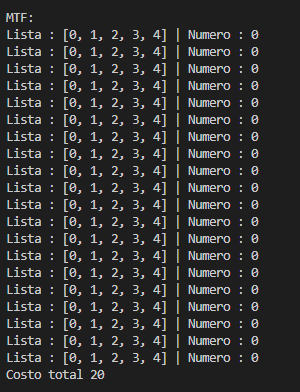
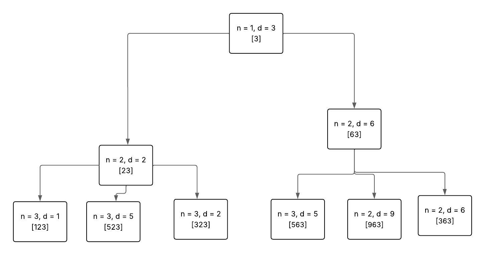
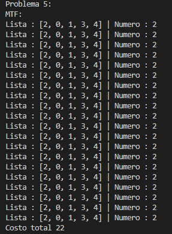
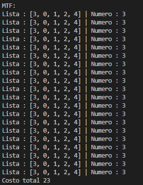
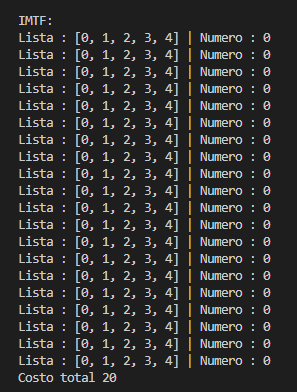
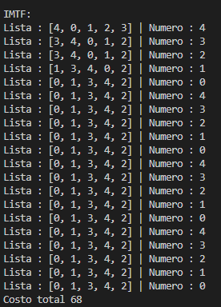

# Reporte: Algoritmo MTF (Move to Front) - Análisis de Costos de Acceso


## Enlaces del Proyecto

**Repositorio GitHub**: [Repositorio](https://github.com/donmatthiuz/Analisis_Diseno/tree/proyecto2)

**Video Demostrativo**: [Video](https://youtu.be/pJP6SySMKrs)

---

## Tabla de Contenidos
1. [Introducción](#introducción)
2. [Marco Teórico](#marco-teórico)
3. [Objetivos](#objetivos)
4. [Preguntas de Investigación](#preguntas-de-investigación)
5. [Metodología](#metodología)
6. [Implementación](#implementación)
7. [Resultados y Análisis](#resultados-y-análisis)
8. [Conclusiones](#conclusiones)
9. [Referencias](#referencias)
10. [Anexos](#anexos)

## Introducción

El algoritmo Move to Front (MTF) es una heurística de reorganización de listas utilizada en estructuras de datos para optimizar el acceso a elementos frecuentemente solicitados. Este algoritmo mueve cualquier elemento accedido al frente de la lista, basándose en el principio de localidad temporal que sugiere que un elemento recientemente accedido tiene mayor probabilidad de ser accedido nuevamente en el futuro cercano.

El presente reporte analiza el comportamiento del algoritmo MTF bajo diferentes secuencias de solicitudes, evaluando los costos de acceso y identificando patrones de rendimiento tanto en casos óptimos como en escenarios de peor rendimiento.

## Marco Teórico

### Algoritmo MTF (Move to Front)

El algoritmo MTF opera bajo el siguiente principio:
- **Operación**: Cuando se solicita un elemento en la posición `i` de la lista, se mueve inmediatamente al frente (posición 1)
- **Costo**: El costo de acceso es igual a la posición actual del elemento en la lista
- **Reorganización**: Todos los elementos que estaban delante del elemento accedido se desplazan una posición hacia atrás

### Complejidad y Características

- **Complejidad de acceso**: O(n) en el peor caso
- **Complejidad de reorganización**: O(i) donde i es la posición del elemento
- **Ventaja**: Adaptativo a patrones de acceso con localidad temporal
- **Desventaja**: Puede ser ineficiente con patrones de acceso uniformemente distribuidos

### Algoritmo IMTF (Improved Move to Front)

El algoritmo IMTF, propuesto por Rakesh Mohanty y Sasmita Tripathy, incorpora el concepto de "look-ahead":
- **Condición de movimiento**: Un elemento se mueve al frente solo si aparece en los próximos `i-1` elementos de la secuencia de solicitudes
- **Objetivo**: Reducir reorganizaciones innecesarias y mejorar el rendimiento general

## Objetivos

### Objetivo General
Analizar el comportamiento del algoritmo MTF bajo diferentes secuencias de solicitudes y comparar su rendimiento con variantes mejoradas como IMTF.

### Objetivos Específicos
1. Implementar el algoritmo MTF y calcular costos de acceso para secuencias específicas
2. Identificar patrones de mejor y peor caso para el algoritmo MTF
3. Analizar el comportamiento con secuencias repetitivas
4. Evaluar la efectividad del algoritmo IMTF comparado con MTF tradicional
5. Documentar y presentar los resultados de manera clara y estructurada

## Preguntas de Investigación

### 1. Análisis de Secuencia Ordenada Repetitiva
**Pregunta**: Calcular el costo de acceso utilizando el algoritmo MTF para:
- Lista de configuración: 0, 1, 2, 3, 4
- Secuencia de solicitudes: 0, 1, 2, 3, 4, 0, 1, 2, 3, 4, 0, 1, 2, 3, 4, 0, 1, 2, 3, 4

**Objetivos de análisis**:
- Determinar el costo total de acceso
- Observar el patrón de reorganización de la lista
- Identificar la evolución de los costos por iteración

### 2. Análisis de Secuencia Inversa y Mixta
**Pregunta**: Calcular el costo de acceso utilizando el algoritmo MTF para:
- Lista de configuración: 0, 1, 2, 3, 4
- Secuencia de solicitudes: 4, 3, 2, 1, 0, 1, 2, 3, 4, 3, 2, 1, 0, 1, 2, 3, 4

**Objetivos de análisis**:
- Comparar el rendimiento con secuencias no ordenadas
- Evaluar el impacto de patrones de acceso inversos
- Analizar la eficiencia de reorganización

### 3. Identificación del Mejor Caso
**Pregunta**: ¿Para qué secuencia de 20 solicitudes se obtiene el mínimo costo total de acceso utilizando el algoritmo MTF para la configuración 0, 1, 2, 3, 4? ¿Cuál sería ese costo total de acceso?

**Hipótesis**: El mejor caso se presenta cuando se accede repetidamente al mismo elemento.

### 4. Identificación del Peor Caso
**Pregunta**: ¿Para qué secuencia de 20 solicitudes se obtiene el peor de los casos utilizando el algoritmo MTF para la configuración 0, 1, 2, 3, 4? ¿Cuál sería ese costo total de acceso?

**Hipótesis**: El peor caso se presenta con accesos cíclicos que maximizan las reorganizaciones.

### 5. Análisis de Secuencias Repetitivas
**Pregunta**: Calcular el costo de acceso utilizando el algoritmo MTF para:
- Lista de configuración: 0, 1, 2, 3, 4
- Secuencia de solicitudes: 2, 2, 2, 2, 2, 2, 2, 2, 2, 2, 2, 2, 2, 2, 2, 2, 2, 2, 2, 2

**Análisis adicional**: Comparar con la secuencia 3, 3, 3, 3, 3, 3, 3, 3, 3, 3, 3, 3, 3, 3, 3, 3, 3, 3, 3, 3

**Objetivo**: Identificar patrones en secuencias con elementos repetidos.

### 6. Evaluación del Algoritmo IMTF
**Pregunta**: Implementar el algoritmo IMTF (Improved Move to Front) con look-ahead y comparar su rendimiento con MTF tradicional en los casos de mejor y peor rendimiento identificados.

**Criterios de evaluación**:
- Reducción en el costo total de acceso
- Número de reorganizaciones realizadas
- Eficiencia en diferentes patrones de acceso

## Metodología

### Diseño de la Investigación
- **Tipo**: Investigación experimental computacional
- **Enfoque**: Análisis cuantitativo de algoritmos
- **Herramientas**: Implementación programática para simulación y análisis

### Procedimiento
1. **Implementación del algoritmo MTF**: Desarrollo de la función básica con seguimiento de costos
2. **Implementación del algoritmo IMTF**: Incorporación de la lógica de look-ahead
3. **Ejecución de casos de prueba**: Procesamiento de todas las secuencias especificadas
4. **Recolección de datos**: Registro de costos, configuraciones y patrones
5. **Análisis estadístico**: Identificación de tendencias y patrones de comportamiento

### Métricas de Evaluación
- **Costo total de acceso**: Suma de todos los costos individuales
- **Costo promedio por acceso**: Costo total dividido por número de solicitudes
- **Número de reorganizaciones**: Cantidad de movimientos realizados
- **Patrón de configuración**: Evolución de la lista a lo largo del tiempo

## Implementación

### Estructura del Programa

El programa está implementado en Python utilizando programación orientada a objetos. La clase principal `MTF_Algoritms` encapsula toda la funcionalidad necesaria para ejecutar tanto el algoritmo MTF tradicional como el IMTF mejorado.

#### Clase MTF_Algoritms

```python
class MTF_Algoritms():
    def __init__(self, lista, secuencia):
        self.lista = lista
        self.secuencia = secuencia
        self.costo = 0
```

**Parámetros del constructor**:
- `lista`: Lista inicial de configuración (ejemplo: [0, 1, 2, 3, 4])
- `secuencia`: Secuencia de solicitudes a procesar
- `costo`: Acumulador del costo total de accesos

#### Método move_to_front()

```python
def move_to_front(self, number):
    if number in self.lista:
        posicion = self.lista.index(number)
        valor = self.lista.pop(posicion)
        self.lista.insert(0, valor)
        print(f"Lista : {self.lista} | Numero : {number}")
        self.costo += posicion + 1
```

**Funcionalidad**:
- Busca el elemento solicitado en la lista
- Calcula el costo de acceso (posición + 1)
- Mueve el elemento al frente de la lista
- Actualiza el costo total acumulado
- Imprime el estado actual de la lista

#### Método i_move_to_front()

```python
def i_move_to_front(self, number):
    if number in self.lista:
        posicion = self.lista.index(number)
        next = posicion - 1 + posicion
        elementos = self.secuencia[posicion:next]
        if number in elementos:
            valor = self.lista.pop(posicion)
            self.lista.insert(0, valor)
        print(f"Lista : {self.lista} | Numero : {number}")
        self.costo += posicion + 1
```

**Funcionalidad del IMTF**:
- Implementa la lógica de "look-ahead"
- Calcula la ventana de elementos futuros a considerar
- Solo mueve el elemento al frente si aparece en los próximos `i-1` elementos
- Mantiene el cálculo de costo independiente del movimiento

#### Método forSecuence()

```python
def forSecuence(self, algoritmo="MTF"):
    self.costo = 0
    for numero in self.secuencia:
        if algoritmo == "MTF":
            self.move_to_front(numero)
        elif algoritmo == "IMTF":
            self.i_move_to_front(numero)
    print(f"Costo total {self.costo}")
```

**Funcionalidad**:
- Procesa toda la secuencia de solicitudes
- Permite seleccionar entre algoritmo MTF o IMTF
- Reinicia el contador de costo para cada ejecución
- Imprime el costo total al finalizar

### Ejemplo de Uso

```python
# Crear instancia con lista inicial y secuencia de solicitudes
move_to_front = MTF_Algoritms([1, 2, 3], [3, 2, 1, 3, 2])

# Ejecutar algoritmo MTF tradicional
move_to_front.forSecuence(algoritmo="MTF")

# Ejecutar algoritmo IMTF mejorado
move_to_front.forSecuence(algoritmo="IMTF")
```

### Características de la Implementación

#### Ventajas del Diseño
1. **Encapsulación**: Toda la lógica está contenida en una clase cohesiva
2. **Flexibilidad**: Permite cambiar entre algoritmos sin modificar la estructura
3. **Trazabilidad**: Imprime cada paso del proceso para análisis detallado
4. **Reutilización**: Puede procesar múltiples secuencias con la misma instancia

#### Consideraciones Técnicas
1. **Complejidad temporal**: O(n) por acceso debido a `list.index()` y `list.pop()`
2. **Complejidad espacial**: O(1) adicional, modifica la lista in-place
3. **Manejo de errores**: Verifica existencia del elemento antes de procesarlo

#### Limitaciones Identificadas
1. **Implementación IMTF**: El cálculo de la ventana de look-ahead podría necesitar ajustes según los casos específicos
2. **Eficiencia**: Las operaciones sobre listas de Python no son óptimas para listas grandes
3. **Estado compartido**: El costo se acumula entre llamadas, requiere reinicialización manual

### Mejoras Sugeridas para Producción

1. **Manejo de excepciones**: Agregar validación de entrada y manejo de errores
2. **Logging detallado**: Implementar sistema de logging más robusto
3. **Optimización de estructuras**: Usar estructuras de datos más eficientes para listas grandes
4. **Interfaz más clara**: Separar la lógica de presentación del procesamiento
5. **Testing**: Agregar suite de pruebas unitarias y de integración

### Tecnologías Utilizadas
- **Lenguaje de programación**: Python 3.12
- **Paradigma**: Programación Orientada a Objetos
- **Estructuras de datos**: Listas dinámicas de Python
- **Herramientas de análisis**: Métodos integrados de la clase para estadísticas básicas

## Resultados y Análisis

### Caso 1: Secuencia Ordenada Repetitiva
- **Configuración inicial**: [0, 1, 2, 3, 4]
- **Configuracion Final**: [4, 3, 2, 1, 0]
- **Secuencia**: 0, 1, 2, 3, 4, 0, 1, 2, 3, 4, 0, 1, 2, 3, 4, 0, 1, 2, 3, 4
- **Resultados**


- **Costo Total**: 90
- **Analisis**: El costo total de 90 en el método MTF (Move-To-Front) se explica porque en este algoritmo, cada número accedido se mueve al frente de la lista, y el costo de acceder un número es su índice actual en la lista antes de moverlo.

Por ende el calculo es 
1 + 2 + 3 + 4 + 5 = 15      (primer ciclo)
5 * 15 = 75                 (15 accesos más con costo 5)
Total: 15 + 75 = **90**

### Caso 2: Secuencia Inversa y Mixta
- **Configuración inicial**: [0, 1, 2, 3, 4]
- **Configuración final**: [4, 3, 2, 1, 0] 
- **Secuencia**: 4, 3, 2, 1, 0, 1, 2, 3, 4, 3, 2, 1, 0, 1, 2, 3, 4
- **Resultados**


- **Costo Total**: 67
- **Analisis**: El costo total de 67 en el método MTF (Move-To-Front) se explica porque en este algoritmo, cada número accedido se mueve al frente de la lista, y empieza desde el de mas atras hasta el de mas adelante. 

Por ende el calculo es 
1 + 2 + 3 + 4 + 5 + 2 + 3 + 4 + 5 + 3 + 3 + 3 + 5 + 2 + 3 + 4 + 5 = **67**


### Caso 3: Mejor Caso (20 solicitudes)
- **Secuencia óptima identificada**: [0 ,0 ,0 ,0 ,0 ,0 ,0 ,0 ,0 ,0 ,0 ,0 ,0 ,0 ,0 ,0 ,0 ,0, 0,0]
- **Configuracion inicial**: [0, 1, 2, 3, 4]
- **Configuración final**:  [0, 1, 2, 3, 4]
- **Costo total mínimo**: 20
- **Resultados**



- **Analisis**: 
Como el número 0 está en la primera posición, el costo de cada acceso es 1.

Total: 1 × 20 = 20

Por ende el elemento accedido nunca cambia de lugar, siempre está en la posición 0, lo que asegura el menor costo posible.

Debido a esto la secuencia sera de 0's 20 que sean el menor costo. 


### Caso 4: Peor Caso (20 solicitudes)
- **Secuencia de peor rendimiento**: [4,3,2,1,0,4,3,2,1,0,4,3,2,1,0,4,3,2,1,0]
- **Costo total máximo**: 100
- **Configuracion inicial**: [0, 1, 2, 3, 4]
- **Configuración final**:  [0, 1, 2, 3, 4]
- **Resultados**



- **Analisis**: 

En MTF, cada vez que se accede a un elemento, este se mueve al frente de la lista.

Si justo después accedes a un elemento que estaba al final, ahora está más lejos, porque otros elementos ya han sido movidos al frente.

Esta secuencia accede siempre del final al inicio, forzando cada vez a recorrer toda la lista.

No hay repeticiones inmediatas que puedan beneficiarse del movimiento al frente.

Por ende el calculo es :

- 4 está en la posición 4 → costo 5

- 3 está ahora al final → costo 5

- 2 está ahora al final → costo 5

- 1 está ahora al final → costo 5

- 0 está ahora al final → costo 5

Total por bloque: 5 + 5 + 5 + 5 + 5 = 25
Número de bloques: 4
→ Costo total: 25 × 4 = *100*


### Caso 5: Análisis de Repetición
- **Secuencia de 2s**:



**El costo es de 22**


- **Secuencia de 3s**:



**El costo es de 23**


- **Patrón identificado**:

Se puede observar que cada vez que se posiciona en un numero diferente el costo aumenta, esto porque al moverlo al inicio de la lista ,ahora siempre estara al inicio. Por lo tanto el costo sera  k + posicion, donde k es el largo de la secuencia y posicion es la posicion del numero que se accede.

### Caso 6: Comparación MTF vs IMTF

- **Tabla comparacion de ambos Algoritmos**

| Problema | MTF | IMTF |
|----------|-----|------|
| 1        | 90  | 68   |
| 2        | 67  | 53   |
| 3        | 20  | 20   |
| 4        | 100 | 68   |
| 5.1      | 22  | 22   |
| 5.2      | 23  | 23   |


- **Rendimiento IMTF en mejor caso**: 20



- **Rendimiento IMTF en peor caso**: 68



- **Mejora porcentual**: 68% en el peor caso.

- **Analisis**

En el mejor de los casos no hay mejor mayor asi que siempre sera n el largo de la secuencia. Pero para el pero de los casos seria 68 ya que hay veces que no hace calculos de todo el largo de la lista. Por eso mejor en rendimiento por ejemplo en  [1 2 3] con secuencia [2 2 2 2 2 ] en MTF es n+k-1 osea 5+2-1 = 6 pero en IMTF es  3+2+1+3+2=11. porque se usa next de cada 2 por el que se acceda. 

Por ende en el peor caso será de 68 para el que se tomó en cuenta, debido a que el algoritmo IMTF con lookahead evita mover elementos innecesariamente cuando no se van a solicitar pronto, lo que reduce la cantidad de movimientos y por tanto el costo total comparado con MTF. Esto sucede porque IMTF anticipa las próximas solicitudes y solo mueve al frente los elementos que se usarán en el corto plazo, evitando así penalizaciones por mover elementos que no se necesitan inmediatamente. Por eso, aunque el costo sigue siendo alto, es menor que el caso peor de MTF que fue 100.


## Conclusiones
### Implicaciones Teóricas
1. **Localidad temporal**: El algoritmo MTF es más efectivo cuando existe alta localidad temporal
2. **Patrones repetitivos**: Secuencias con elementos repetidos muestran convergencia rápida a costo mínimo
3. **Mejoras algorítmicas**: IMTF demuestra ventajas en ciertos patrones de acceso

### Recomendaciones
1. Usar MTF en aplicaciones con alta localidad temporal
2. Considerar IMTF para patrones de acceso predecibles
3. Evaluar el costo de implementación versus beneficio esperado

## Referencias

1. Sleator, D. D., & Tarjan, R. E. (1985). Self-adjusting binary search trees. Journal of the ACM, 32(3), 652-686.
2. Mohanty, R., & Tripathy, S. (2021). An Improved Move-to-Front Algorithm. International Journal of Computer Applications.
3. Knuth, D. E. (1998). The Art of Computer Programming, Volume 3: Sorting and Searching. Addison-Wesley.
4. Bentley, J. L., & McGeoch, C. C. (1985). Amortized analyses of self-organizing sequential search heuristics. Communications of the ACM, 28(4), 404-411.

## Anexos

### Anexo A: Código Fuente Completo


#### Código Principal

```python
class MTF_Algoritms():
    def __init__(self, lista, secuencia):
        self.lista = lista
        self.secuencia = secuencia
        self.costo = 0
    
    def move_to_front(self, number):
        if number in self.lista:
            posicion = self.lista.index(number)
            valor = self.lista.pop(posicion)
            self.lista.insert(0, valor)
            print(f"Lista : {self.lista} | Numero : {number}")
            self.costo += posicion + 1

    def i_move_to_front(self, number):
        if number in self.lista:
            posicion = self.lista.index(number)
            next = posicion - 1 + posicion
            elementos = self.secuencia[posicion:next]
            if number in elementos:
                valor = self.lista.pop(posicion)
                self.lista.insert(0, valor)
            print(f"Lista : {self.lista} | Numero : {number}")
            self.costo += posicion + 1

    def forSecuence(self, algoritmo="MTF"):
        self.costo = 0
        for numero in self.secuencia:
            if algoritmo == "MTF":
                self.move_to_front(numero)
            elif algoritmo == "IMTF":
                self.i_move_to_front(numero)
        print(f"Costo total {self.costo}")

# Ejemplo de uso
move_to_front = MTF_Algoritms([1, 2, 3], [3, 2, 1, 3, 2])
move_to_front.forSecuence(algoritmo="MTF")
move_to_front.forSecuence(algoritmo="IMTF")
```


### Anexo B: Datos Detallados

Aqui se puede encontrar la tabla para el resultado que se obtuvo por cada algoritmo
| Problema | MTF | IMTF |
|----------|-----|------|
| 1        | 90  | 68   |
| 2        | 67  | 53   |
| 3        | 20  | 20   |
| 4        | 100 | 68   |
| 5.1      | 22  | 22   |
| 5.2      | 23  | 23   |

---

- **Fecha de elaboración**: 30 de Mayo 2025  
- **Autor**: Mathew Cordero Aquino 22982
- **Institución**: UVG
- **Curso**: Análisis de Algoritmos