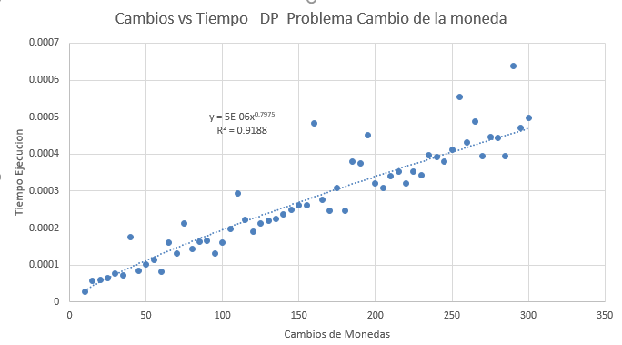

# Proyecto 1 Analisis y Diseño de Algoritmos

## Integrantes

- Pedro Pablo Guzman
- Mathew Cordero Aquino

## Problema elegido.

**Problema de la devolucion de Monedas o Coin Change Problem**

### Definicion

Dada una cantidad específica de cambio a devolver y un número ilimitado de cada tipo de monedas, ¿cuál es la menor cantidad de monedas necesarias para alcanzar la cantidad de cambio especificada?

Se sabe que :

- Existen infinitas monedas de cada tipo

- Las monedas son potencias de k {k^0, k^1,.. ,k^n}
- Si no se cumple, el algoritmo no encontrara la solucion optima

### Fuentes

- cs. (2014). Problema de creación de cambios. Obtenido de Pagium: https://en-m-wikipedia-org.translate.goog/wiki/Change-making_problem?_x_tr_sl=en&_x_tr_tl=es&_x_tr_hl=es&_x_tr_pto=tc
- Dumadag, J. (2019). Solving the Coin Change problem with Dynamic Programming. Obtenido de Medium: https://medium.com/@j.dumadag718/solving-the-coin-change-problem-with-dynamic-programming-2910ac075ddd 

## Algoritmos de Solucion

### DAC

Para el enfoque divide an conquer, se utilizará este enfoque:

- El algoritmo debe recibir 2 entradas, el array de monedas a utilizar y el valor de cambio a dar
- El algoritmo da como resultado 2 salidas: el array de monedas utilizadas y el número mínimo de monedas usadas
- Caso base 1: el valor de S = 0, en se caso retornamos que el número mímimo de monedas es de 0 y se devuelve un array vacío
- Caso base 2: Si S < 0, devolvemos el valor infinito
- Luego, recorremos el array de monedas y llamamos recursivamente la función, ahora el valor de S será la diferencia entre el valor de S inicia y el valor de la moneda a analizar.
- Luego, si el valor del resultado obtenido no es igual a infinito y es menor al último valor almacenado del valor mínimo de monedas, entonces cambiamos el valor de mincoins y el del array de monedas usadas. 

#### Fuentes

- https://www.cs.uni.edu/~fienup/cs270s04/lectures/lec6_1-29-04_coin_change_web.htm

### DP

En este usaremos un enfoque botton up, definiendo lo siguiente

- n monedas seran X1, X2 ... Xn
- cantidad a devolver c
- cambio(n,c) minimas monedas para devolver c usando X1, .....Xn
- Si Xn > c descartamos usar Xn
- cambio  = cambio (n-1,c)
- Si Xn< c podemos usar o no Xn
- Si usamos Xn cambio (n, c-Xn)+1
- Si no lo usamos cambio (n-1,c)
- Escogemos la minima cantidad

Ahora usaremos una tabla de tipo t[i, j] el numero de monedas es el valor de Xi para devolver la cantidad j de esas monedas.

- j = cambio a devolver
- i = tipo de monedas
- i,j = cantidad de monedas de cada valor

#### Fuentes:

- López, F. (2021). Programación Dinámica: Devolución de Cambio de Monedas. Obtenido de Youtube: https://www.youtube.com/watch?v=Sf4OKx1Wz9w

## Analisis Teorico

### DAC

Para solucionar el problema usando estrategia de divide and conquer, se debe dividir el probelma inicial en subproblemas más pequeños, luego resolver dichos subproblemas y luego juntar sus soluciones para determinar el resultado del problema más grande. En este caso, la división del problema en subproblemas se hace analizando la diferencia del valor de cambio inicial con el valor de cada moneda del conjunto de datos disponibles, eso nos deja con la siguiente ecuación de recurrencia; 

$$
T(S) = |coins| * T(S-c) + O(1)
$$

Siempre se hace una operación de comparación la cuál tiene 
Esta sería la representación de la división del problema usando un árbol de recursión: 

En cada nodo dividermos el problema $$|coins|$$ veces y el peor caso lo obtenemos cuando la moneda de valor 1 está en el conjunto de monedas, pues por ejmplo, si tenemos un valor inciial de 50, para la moneda 1 haremos un subproblema del valor S-1 en cada nivel del árbol hasta que lleguemos a 0, esto hace que tengamos S niveles en total. Para cada nivel el número de nodos crecerá exponencialmente pues cada nodo lo dividiremos en $$|coins|$$ subproblemas, en cada nodo se ejecuta una operación de tiempo constante, entonces el tiempo total de ejecución en el peor de los casos será de $$O(|\text{coins}|^S)$$. 

### DP

## Analisis Empirico

### DAC

Se usará este conjunto de monedas para el análisis: {1,5,10,12,25,50} y valores desde el 5 al 65 para las pruebas. 
En el análisis teorico se determinó que el tiempo de ejecución de este algoritmo era de $$O(|\text{coins}|^S)$$, donde $$|coins|$$ es la cardinalidad del conjunto de monedas y $$S$$ es el valor inicial de la moneda, por esa razó´n en el script de python se utilizaron varias librerías para realizar una regresión lineal con los datos obtenidos. Los resultados fueron los siguientes:

Se puede observar que el modelo se adapta bien a un modelo exponecial, incluso el valor del coeficiente R^2 fue de 0.98. Por esa razón se puede confirmar que la complejidad temporal de un algoritmo que usa una estregia DAC para la solución del problema es exponencial. 

$$O(|\text{coins}|^S)$$

Donde $$|coins|$$ es el número de monedas en el conjunto de monedas y $$S$$ es el valor inicial del problema 

### DP
Podemos ver en el siguiente grafico el resultado de compilar 30 diferentes tipos de cambios para los tipos de monedas {1,5,10,12,25,50}

- Tipos de Monedas
{1,5,10,12,25,50}

- Entradas:
De 0 a 300 de 5 en 5

#### Analisis

Podemos ver que el R^2 de la regresion es del 0.8675 casi 1 esto quiere decir que es bastante bueno , teniendo una ecuacion lineal siendo esta

$$
2 \times 10^{-6} x + 3 \times 10^{-5}
$$

Lo que nos indica que, en notación Big O, su complejidad temporal es **polinomial**, es decir:

$$
O(n * m)
$$

Esto coincide con el analisis previo realizado sobre el mismo algoritmo

## Conlcusiones

Gracias a los resultados obtenidos, se pudo determinar que para resolver el Coin Change Problem, una estretegia de programación dinámica es más útil pues su complejidad temporal es significativamente más baja que la solución con una estretegia de Divide And Conquer, esto puede deberse a la memoización que se utiliza en la programación dinámica pues esto ayuda a que el algoritmo no realice cálculos redundantes. 