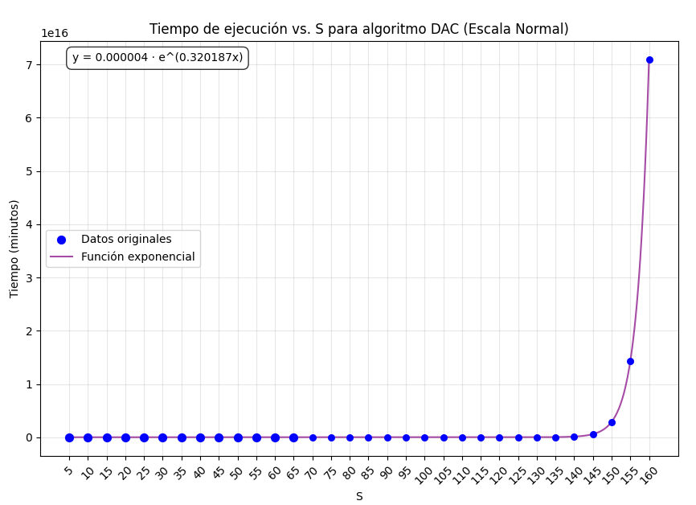
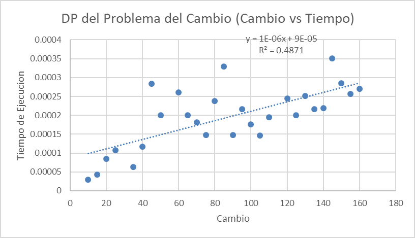

# Proyecto 1 Analisis y Diseño de Algoritmos

[Link al Repositorio](https://github.com/donmatthiuz/Analisis_Diseno)

## Integrantes

- Pedro Pablo Guzman [22111]
- Mathew Cordero Aquino [22982]

## Problema elegido.

**Problema de la devolucion de Monedas o Coin Change Problem**

### Definicion

Dada una cantidad específica de cambio a devolver y un número ilimitado de cada tipo de monedas, ¿cuál es la menor cantidad de monedas necesarias para alcanzar la cantidad de cambio especificada?


Se sabe que :

- Existen infinitas monedas de cada tipo

- Las monedas son potencias de k {k^0, k^1,.. ,k^n}
- Si no se cumple, el algoritmo no encontrara la solucion optima

### Fuentes


- cs. (2014). Problema de creación de cambios. Obtenido de Pagium: https://en-m-wikipedia-org.translate.goog/wiki/Change-making_problem?_x_tr_sl=en&_x_tr_tl=es&_x_tr_hl=es&_x_tr_pto=tc
- Dumadag, J. (2019). Solving the Coin Change problem with Dynamic Programming. Obtenido de Medium: https://medium.com/@j.dumadag718/solving-the-coin-change-problem-with-dynamic-programming-2910ac075ddd 


## Algoritmos de Solucion

### DAC

Para el enfoque divide an conquer, se utilizará este enfoque:

- El algoritmo debe recibir 2 entradas, el array de monedas a utilizar y el valor de cambio a dar
- El algoritmo da como resultado 2 salidas: el array de monedas utilizadas y el número mínimo de monedas usadas
- Caso base 1: el valor de S = 0, en se caso retornamos que el número mímimo de monedas es de 0 y se devuelve un array vacío
- Caso base 2: Si S < 0, devolvemos el valor infinito
- Luego, recorremos el array de monedas y llamamos recursivamente la función, ahora el valor de S será la diferencia entre el valor de S inicia y el valor de la moneda a analizar.
- Luego, si el valor del resultado obtenido no es igual a infinito y es menor al último valor almacenado del valor mínimo de monedas, entonces cambiamos el valor de mincoins y el del array de monedas usadas. 


#### Ejecucion

```python
python DAC.py
```

#### Fuentes

- https://www.cs.uni.edu/~fienup/cs270s04/lectures/lec6_1-29-04_coin_change_web.htm

### DP


En este usaremos un enfoque botton up, definiendo lo siguiente

- n monedas seran X1, X2 ... Xn
- cantidad a devolver c
- cambio(n,c) minimas monedas para devolver c usando X1, .....Xn
- Si Xn > c descartamos usar Xn
- cambio  = cambio (n-1,c)
- Si Xn< c podemos usar o no Xn
- Si usamos Xn cambio (n, c-Xn)+1
- Si no lo usamos cambio (n-1,c)
- Escogemos la minima cantidad

Ahora usaremos una tabla de tipo t[i, j] el numero de monedas es el valor de Xi para devolver la cantidad j de esas monedas.

- j = cambio a devolver
- i = tipo de monedas
- i,j = cantidad de monedas de cada valor


#### Ejecucion

```python
python DP.py
```

#### Fuentes:

- López, F. (2021). Programación Dinámica: Devolución de Cambio de Monedas. Obtenido de Youtube: https://www.youtube.com/watch?v=Sf4OKx1Wz9w
- UMA. (s.f.). PROGRAMACIÓN DINÁMICA. En UMA, TECNICAS DE DISEÑO DE ALGORITMOS (págs. 193-199).


## Analisis Teorico

### DAC

Para solucionar el problema usando estrategia de divide and conquer, se debe dividir el probelma inicial en subproblemas más pequeños, luego resolver dichos subproblemas y luego juntar sus soluciones para determinar el resultado del problema más grande. En este caso, la división del problema en subproblemas se hace analizando la diferencia del valor de cambio inicial con el valor de cada moneda del conjunto de datos disponibles. 

Este es el pseudocódigo del algoritmo: 

```pseudocodigo
calcularMonedas (monedas, cambio_total):                   # Definición de la función
    Si cambio_total es igual a 0:                          # Compración simple, T(1) + C
        Devolver 0 y array vacío                           
    Si cambio_total es menor que 0:                        # Comparación simple, T(1) + C
        Devolver infinito y array vacío
    monedas_necesarias = infinito                          # Asignación - T(1) + C
    mejor_combinación = Array vacío                        # Asignación, T(1) + C
                                                           # Si n es el número de monedas
    Para cada moneda en monedas:                           # Se ejecuta n + 1 veces
        resultado, combinacion = calcularMonedas(moendas, cambio_total - moneda)
        # Recursión T(cambio_total - monedas)
        Si resultado no es infinito y resultado + 1 < monedas necesarias: #Comparación, T(1)+C
            monedas_mínimas = resultado +1  #Asignación, T(1) + C
            mejor_combinación = combinacion + [moneda] # Asignación, T(1) + C

    regresar monedas_necesarias, mejor_combinación
```

Se puede observar con el algoritmo que la mayoría de las operaciones requieren un tiempo constante para ejecutarse sin embargo la recursión se ejecuta n veces.

Para formar la ecuación de recurrencia, debemos tener en cuenta que: 

- Se cuenta con un conjunto que contiene todos los tipos de monedas disponibles que podemos utilizar para dar el cambio, a este conjunto le llameremos $$coins$$
- $$S$$ hacereferencia al cambio inicial que debemos devolver con las monedas
- La recuerrencia se ejecuta n veces, ahora lo llamaremos |coins| haciendo referencia que  es la cardinalidad del conjunto de monedas.

Con eso en cuenta, tenemos esta relación de recursión: 

$$
T(S) =
\begin{cases}
\infty, & \text{si } S < 0  \\\\
0, & \text{si } S = 0 \\\\
|coins| * T(S-c) + O(1), & \text{si } S > 0  \\\\
\end{cases}
$$

Donde $$|coins|$$ es el número de monedas disponibles, $$S$$ es el cambio que debemos devolver, $$c$$ es el valor de una de las monedas del conjutno de monedas. Siempre se realizan operaciones de tiempo constante, por eso se agrega la notación $$O(1)$$
Esta sería la representación de la división del problema usando un árbol de recursión: 


En cada nodo dividermos el problema $$|coins|$$ veces y el peor caso lo obtenemos cuando la moneda de valor 1 está en el conjunto de monedas, pues por ejemplo, si tenemos un valor incial de 50, para la moneda 1 haremos un subproblema del valor S-1 en cada nivel del árbol hasta que lleguemos a 0, esto hace que tengamos S niveles en total. Para cada nivel el número de nodos crecerá exponencialmente pues cada nodo lo dividiremos en $$|coins|$$ subproblemas. Al final tendremos un árbol de $$S$$ niveles con $$|coins|$$ nodos en cada nodo se ejecuta una operación de tiempo constante, eso nos deja que al final tengamos un árbol con $$(|coins|^S)$$ nodos y como cada uno ejecuta una tarea de tiempo constante, entonces decimos que la complejidad del algoritmo es: 

$$O(|\text{coins}|^S)$$ 

Se observa que el tiempo de complejidad para este algoritmo es exponencial y depende del número de monedas y el tamaño del cambio total que debemos devolver. 

### DP

**Analisis de Funcion de Recurrencia**
Sea n el número de tipos de monedas distintos, L la cantidad a conseguir y T[1..n]
un vector con el valor de cada tipo de moneda del sistema. Supondremos que
disponemos de una cantidad inagotable de monedas de cada tipo.


LLamaremos C(i,j) al número mínimo de monedas para
obtener la cantidad j restringiéndose a los tipos T[1], T[2], ..., T[i].

Si no se puede
conseguir dicha cantidad entonces C(i,j) = $\infty$ o no hay manera de suplir la cantidad , esto sucede solo en 0. 

En cada paso tenemos 2 opciones

- No incluir ninguna moneda del tipo T(i), osea $C(i,j) = C(i–1,j).$ osea que usaremos la solucion anterior.

- Incluirla, esto quiere decir que el número de
monedas global coincide con el número óptimo de monedas para una cantidad
$(j – T(i))$ más esta moneda $T(i)$ osea que tenemos la solucion anterior mas de la actual. 

Con ello la relacion de recurrencia es la siguiente:

$$
C(i, j) =
\begin{cases}
\infty, & \text{si } i = 1 \text{ y } 1 \leq j < T(i) \\\\
0, & \text{si } j = 0 \\\\
1 + C(i, j - T(i)), & \text{si } i = 1 \text{ y } j \geq T(i) \\\\
C(i-1, j), & \text{si } i > 1 \text{ y } j < T(i) \\\\
\min\left(C(i-1, j), 1 + C(i, j - T(i))\right), & \text{si } i > 1 \text{ y } j \geq T(i)
\end{cases}
$$


**Calcular Complejidad**

Para esto vamos a usar la expansion de la recursion especificamente de $C(i,j)=min(C(i-1,j),1+C(i,j-T(i)))$

El segundo término sugiere que podemos restar repetidamente 
T(i) de  j es decir:

$$C(i,j)=1+C(i,j-T(i))$$

$$C(i,j)=2+C(i,j-2T(i))$$

$$C(i,j)=3+C(i,j-3T(i))$$


Asi hasta encontrar

$$C(i,j)=k+C(i,j-kT(i))$$


La dentemos hasta que j alncance el kT(i)<= 0, lo que significa que k es el numero de veces que podemos restar T(i) osea que k es:

$$
k = \frac{j}{T(i)}
$$


En el peor caso nuestro T(i) sera 1, esto quiere decir que se restara 1 en cada paso dado k = j osea

$$
O(j)
$$

Pero esto es sobre j, si iteramos sobre i entonces tendriamos que en terminos de i ada uno de los 
n
n niveles puede llegar a costar hasta 
$O(j)$ en el peor caso.

Osea

$$
O(ij)
$$

o

$$
O(nW)
$$


**Analisis del Algoritmo**

```pseudocodigo
Para i desde 0 hasta longitud(monedas):                   # n
    Para j desde 1 hasta num hacer:                         # desde 0 hasta n-1
        Si xi > j entonces                                  # T(1) + C - comparación simple
            Si i > 0 entonces                               # T(1) + C - comparación simple
                tabla[i][j] ← tabla[i - 1][j]               # T(1)  + C- asignación simple
            Fin Si
        Sino:                                               # T(1) + C - parte del condicional
            Si i > 0 entonces                               # T(1) + C - comparación simple
                sin_usar ← tabla[i - 1][j]                  # T(1) + C - asignación simple
            Sino
                sin_usar ← INFINITO                         # T(1) + C - asignación simple
            Fin Si
            
            Si tabla[i][j - xi] no es INFINITO entonces         # T(1) + C - comparación simple
                con_usar ← tabla[i][j - xi] + 1             # T(1) + C - asignación y suma
            Sino
                con_usar ← INFINITO                         # T(1) + C - asignación simple
            Fin Si
            
            Si con_usar < sin_usar entonces                 # T(1) + C - comparación simple
                tabla[i][j] ← con_usar                      # T(1) + C - asignación simple
                usadas[i][j] ← VERDADERO                    # T(1) + C - asignación simple
            Sino
                tabla[i][j] ← sin_usar                      # T(1) + C - asignación simple
            Fin Si
        Fin Si
  Fin Para                                                
Fin Para
```

Por ello se hace el siguiente analisis asintotico


$$
T(n) = \sum_{i=0}^{n} \sum_{j=1}^{m} 13 T(1) + C
$$


Si lo desglosamos es 


$$
T(n) = 13\sum_{i=0}^{n} \sum_{j=1}^{m}O(1) + C
$$


$$
T(n) = \sum_{i=0}^{n}m + C
$$


$$
T(n) = nm
$$

En pocas palabras seria la complejidad para nuestro algoritmo de 

$$
O(nxm)
$$

Donde n es la cantidad del tipo de monedas y m es la cantidad a encontrar cambio


## Analisis Empirico

### DAC

Se usará este conjunto de monedas para el análisis: {1,5,10,12,25,50} y valores desde el 5 al 65 para las pruebas. 
En el análisis teorico se determinó que el tiempo de ejecución de este algoritmo era de $$O(|\text{coins}|^S)$$, donde $$|coins|$$ es la cardinalidad del conjunto de monedas y $$S$$ es el valor inicial de la moneda, por esa razó´n en el script de python se utilizaron varias librerías para realizar una regresión lineal con los datos obtenidos. Los resultados fueron los siguientes:





Se puede observar que el modelo se adapta bien a un modelo exponecial, incluso el valor del coeficiente R^2 fue de 0.98. Por esa razón se puede confirmar que la complejidad temporal de un algoritmo que usa una estregia DAC para la solución del problema es exponencial. 

$$O(|\text{coins}|^S)$$

Donde $|coins|$ es el número de monedas en el conjunto de monedas y $S$ es el valor inicial del problema 


### DP
Podemos ver en el siguiente grafico el resultado de compilar 30 diferentes tipos de cambios para los tipos de monedas {1,5,10,12,25,50}

- Tipos de Monedas
{1,5,10,12,25,50}

- Entradas:
De 0 a 160



De 0 a 300


#### Analisis

Podemos ver que el R^2 de la regresion es del 0.8675 casi 1 esto quiere decir que es bastante bueno , teniendo una ecuacion lineal siendo esta

$$
2 \times 10^{-6} x + 3 \times 10^{-5}
$$

Se uso de 0 a 300 ya que una regresion es mas evidente aqui

Lo que nos indica que, en notación Big O, su complejidad temporal es **lineal**, es decir:

$$
O(n)
$$


Pero porque no se supone que deberia ser $O(n x W)$ o  $O(n x L)$ bueno pues sucede por una cosa, y es que n  es constante osea es de 6 exactamente

Esto quiere decir que nunca va a cambiar, y como es constante tendriamos $O(m)$ lo que da como resultado una complejidad lineal. 

Dando asi que coincide con la regresion vista en nuestra grafica. 


## Conclusiones

Gracias a los resultados obtenidos, se pudo determinar que para resolver el Coin Change Problem, una estretegia de programación dinámica es más útil pues su complejidad temporal es significativamente más baja que la solución con una estretegia de Divide And Conquer, esto puede deberse a la memoización que se utiliza en la programación dinámica pues esto ayuda a que el algoritmo no realice cálculos redundantes. 
